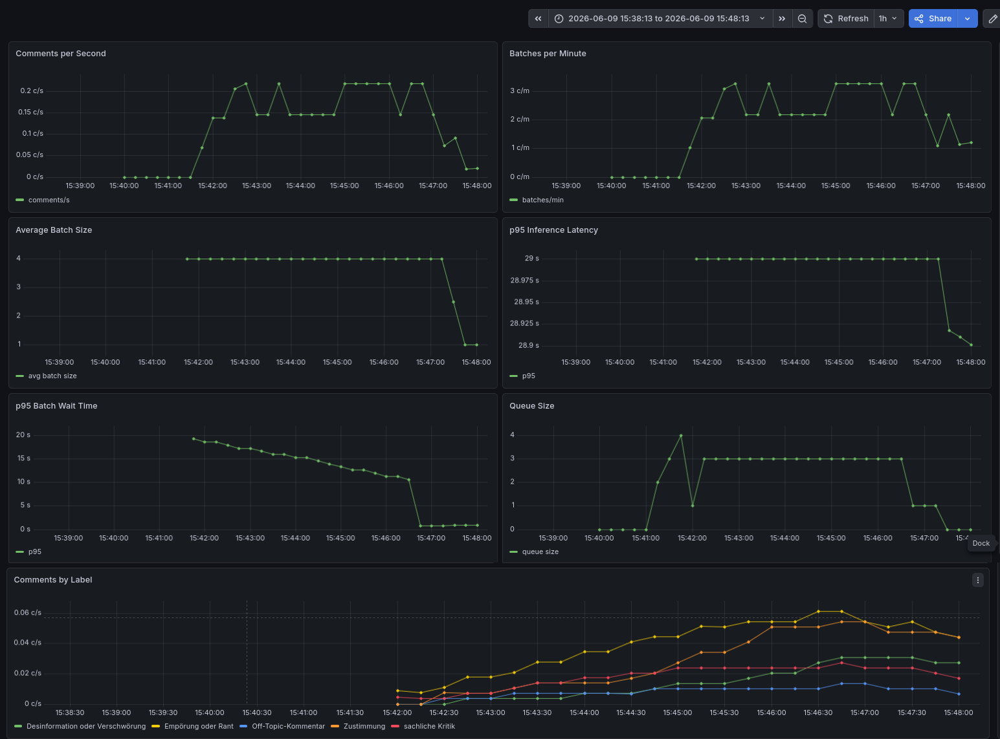

# NLP Comment Classification Service

FastAPI service for zero-shot classification of German comments using `MoritzLaurer/DeBERTa-v3-base-mnli-fever-anli`.

## Usage

### Docker Compose

```bash
# Build and start (CPU)
sudo docker compose up --build
```

### Load Testing (k6)

```bash
# 1. Start the stack first in the background (inference, api, redis, monitoring)
sudo docker compose up --build -d

# 2. In another terminal, run the load test — output is clearly visible here
#    k6 web dashboard will be available at http://localhost:5665
sudo docker compose --profile loadtest run --service-ports --rm k6
```

## API

| Method | Path              | Description                                      |
|--------|-------------------|--------------------------------------------------|
| POST   | `/classify`       | Submit a comment (non-blocking, returns request_id) |
| GET    | `/result/{id}`    | Poll for the classification result               |
| GET    | `/status`         | Check if the inference model has loaded          |

**POST /classify**

```json
{"comment": "Ich habe den Artikel nicht gelesen, aber ich bin trotzdem dagegen."}

{"request_id": "a1b2c3d4-..."}
```

**GET /result/{request_id}**

```json
// while processing → 404
{"detail": "pending"}

// ready
{"comment": "...", "label": "Empörung oder Rant", "score": 0.72}
```

**GET /status**

```json
{"status": "ready", "model": "MoritzLaurer/DeBERTa-v3-base-mnli-fever-anli"}
{"status": "loading"}
```

Labels: `sachliche Kritik`, `Zustimmung`, `Sarkasmus oder Ironie`, `Off-Topic-Kommentar`, `Empörung oder Rant`, `Desinformation oder Verschwörung`

## Architecture

```
Client ──POST /classify──▶ api :8000 ──rpush──▶ Redis queue
                                                     │
                                           batch worker
                                         (size≥4 │ 30s)
                                                     │
                                             POST /predict_batch
                                                     │
                                             inference :8001
                                                     │
Client ◀──GET /result──── api :8000 ◀──rset──────────┘
Client ◀──GET /status ─── api :8000 ──GET /health ──▶ inference
```

### Microbatching implementation

The API layer implements client-side microbatching using a single background worker thread (`batch_worker` in `api/main.py`). The worker maintains an in-memory `batch_buffer` of items that have already been removed from the Redis queue. It flushes the buffer to the inference server when either of the two triggers fires:

| Trigger | Condition | Typical load behaviour |
|---------|-----------|------------------------|
| **Batch size** | 4 items accumulated | Occurs when the queue is keeping up |
| **Timeout** | 30 seconds since the oldest buffered item | Occurs at low load or idle → prevents a single comment from waiting indefinitely |

The flow at the worker level is:

1. **Orphan recovery on startup** — Every `PROCESSING` item from a previous crash is moved back to the queue with `RPOP → LPUSH`.
2. **Requeue retries** — Items in the `RETRY` sorted set whose exponential backoff has elapsed are moved back to the queue.
3. **Pop with atomic acknowledgment** — The worker blocks on `BRPOPLPUSH(queue, processing, timeout=1)`, which removes the rightmost queue item and simultaneously pushes it to the `PROCESSING` list so it can be recovered if the worker crashes.
4. **Buffer fill** — The popped item is appended to the in-memory buffer as the tuple `(data, raw, enqueue_time)`.
5. **Flush** — When either trigger is reached, the worker sends the batch via an HTTP POST to the inference server: `POST /predict_batch` with `{"comments": ["comment1", "comment2", ...]}`. The `raw` value (the original JSON string) is used to remove the item from the `PROCESSING` list with `LREM` once results are stored. If inference fails, the entire batch is moved to the retry sorted set with a capped exponential backoff (`min(2^retries, 30)` seconds) and requeued later. If `MAX_RETRIES` (3) is exceeded, the item is dropped with an error stored in the result cache.
6. **Result caching** — Each comment is stored in Redis under `classify:result:{request_id}` with a TTL of 300 seconds. Clients poll `/result/{id}` against this key.

The `batch_worker` loop also exposes the `microbatch_queue_size` metric, which is the sum of the queue length, buffer size, retry set cardinality, and in-flight processing list length — a direct signal of back-pressure.

### Components

- **redis** — queue decouples request submission from inference
- **api** — FastAPI gateway. Accepts requests, pushes to Redis. Runs the microbatch background worker. Applies exponential backoff on inference failures.
- **inference** — Model server with single (`/predict`) and batch (`/predict_batch`) endpoints, plus a `/health` endpoint for readiness checks.

## Metrics

Both services expose Prometheus metrics on `/metrics`. The following metrics are implemented:

### API Service (`api:8000`)

| Metric | Type | Description |
|--------|------|-------------|
| `comments_classified_total` | Counter | Total number of comments successfully classified. |
| `batches_processed_total` | Counter | Total number of batches sent to the inference server. |
| `batch_size` | Histogram | Number of comments in each processed batch (buckets: 1, 2, 4, 8, 16). Helps verify microbatching behaviour. |
| `batch_inference_duration_seconds` | Histogram | End-to-end time for the inference request per batch (buckets up to 120 s). |
| `batch_wait_time_seconds` | Histogram | How long a comment waits in the microbatch buffer before being flushed (buckets up to 60 s). |
| `microbatch_queue_size` | Gauge | Current number of comments waiting across the Redis queue, microbatch buffer, retry set, and in-flight processing list. |
| `comments_classified_by_label_total` | Counter | Distribution of predicted labels (label dimension). |

### Inference Service (`inference:8001`)

| Metric | Type | Description |
|--------|------|-------------|
| `inference_predictions_total` | Counter | Total number of comments scored by the model. |
| `inference_duration_seconds` | Histogram | Model forward-pass duration per request (buckets up to 30 s). |
| `inference_batch_size` | Histogram | Number of comments passed to the model in a single call. |
| `inference_model_ready` | Gauge | `1` when the model is loaded and serving, `0` otherwise. |

### Most Important Metrics

- **`comments_classified_total`** — throughput indicator. A rising rate means the system is keeping up with load.
- **`batch_size`** — verifies microbatching. Under load the average should approach the configured maximum (4). Near 1 indicates under-utilisation or timeouts.
- **`batch_inference_duration_seconds`** — end-to-end model latency per batch. Spikes here point to GPU/CPU contention or large inputs.
- **`microbatch_queue_size`** — back-pressure signal. A steadily growing queue means the inference service cannot keep up.
- **`batch_wait_time_seconds`** — user-experience proxy. High values mean comments sit in the buffer for a long time before classification.

## Troubleshooting

### `Bind for 0.0.0.0:8001 failed: port is already allocated`

A previous Docker container is still holding port 8001 (often `docker-proxy` running as root).

```bash
# Stop the conflicting container
sudo docker stop $(sudo docker ps -q --filter "publish=8001")

# Or stop everything and start fresh
sudo docker compose down
sudo docker compose up --build -d
```

### `inference` container stuck in `Waiting` then fails to start

The `api` service waits for `inference` to become healthy. If the inference container can't start (e.g., port conflict) or takes too long to load the model, `api` will eventually fail.

- **Port conflict:** see the section above.
- **Model loading time:** `MoritzLaurer/DeBERTa-v3-base-mnli-fever-anli` is ~400 MB. On first download it can take a minute or two. The healthcheck `start_period` in `docker-compose.yml` allows up to 5 minutes for the model to load before marking the container unhealthy.
- **Persistent cache:** The model is cached in a Docker volume (`huggingface_cache` → `/root/.cache/huggingface`). It survives restarts as long as you don't run `docker compose down -v`. To check if the cache exists:

```bash
sudo docker volume ls | grep huggingface_cache
```

## Example run

### Dashboard



### k6 Load Test Output

```text
          /\      Grafana   /‾‾/  
        /\  /  \     |\  __   /  /   
       /  \/    \    | |/ /  /   ‾‾\ 
      /          \   |   (  |  (‾)  |
     / __________ \  |_|\_\  \_____/ 


         execution: local
            script: /scripts/classify_load_test.js
     web dashboard: http://0.0.0.0:5665
            output: -

         scenarios: (100.00%) 1 scenario, 6 max VUs, 6m6s max duration (incl. graceful stop):
                  * classify_ramp: Up to 6 looping VUs for 5m36s over 5 stages (gracefulRampDown: 2m0s, gracefulStop: 30s)

    INFO[0032] OK | request_id=5cb609df-670a-4011-b7d1-936bea4cdac9 | total_latency=12038ms | poll_time=12033ms | attempts=13 | comment="Hervorragend, lass uns das sofort prokrastinieren...." | label=Zustimmung | score=0.64  source=console
    INFO[0032] OK | request_id=4a68f3cb-4d46-4686-902a-dc87bfb497d5 | total_latency=22072ms | poll_time=22067ms | attempts=23 | comment="Die Nachbarn kontrollieren das Wetter mit einer Fernbedienun..." | label=Sarkasmus oder Ironie | score=0.22  source=console
    INFO[0032] OK | request_id=d97cb724-0d0d-46e9-be9a-f3364e604720 | total_latency=32138ms | poll_time=32129ms | attempts=33 | comment="Die Nachbarn kontrollieren das Wetter mit einer Fernbedienun..." | label=Sarkasmus oder Ironie | score=0.22  source=console
    INFO[0032] OK | request_id=ed9595ce-7af3-4527-b1ca-05ff6b0491b3 | total_latency=32139ms | poll_time=32130ms | attempts=33 | comment="Super Idee — und danach erfinden wir Einhörner...." | label=Zustimmung | score=0.29  source=console
    INFO[0052] OK | request_id=4e80980e-1c26-4d3b-abf7-3eb0e119d14a | total_latency=20072ms | poll_time=20069ms | attempts=21 | comment="Ehrlich, das ist schlecht organisiert und unfair...." | label=sachliche Kritik | score=0.82  source=console
    INFO[0052] OK | request_id=91749095-1c39-4d89-9f6a-6d654be202c8 | total_latency=20073ms | poll_time=20070ms | attempts=21 | comment="Super Idee — und danach erfinden wir Einhörner...." | label=Zustimmung | score=0.29  source=console
    INFO[0052] OK | request_id=9d600c6e-54c9-43fb-944f-0db77db72231 | total_latency=20093ms | poll_time=20087ms | attempts=21 | comment="Natürlich, das macht total Sinn (Augenrollen)...." | label=Zustimmung | score=0.4  source=console
    INFO[0052] OK | request_id=5334c39f-13a8-4c15-9fc4-e8e467b94c6b | total_latency=20094ms | poll_time=20088ms | attempts=21 | comment="Es gibt eine Verschwörung, dass Socken bewusst verschwinden...." | label=Desinformation oder Verschwörung | score=0.55  source=console
    INFO[0076] OK | request_id=5872b02a-caf8-4f28-881e-cf93021e25d5 | total_latency=36127ms | poll_time=36121ms | attempts=37 | comment="Die Überschrift verspricht mehr, als der Text liefert...." | label=Desinformation oder Verschwörung | score=0.37  source=console
    INFO[0076] OK | request_id=31c4f1b6-01a2-4dc3-919d-d1436d3cf29e | total_latency=24077ms | poll_time=24075ms | attempts=25 | comment="Ich fühle mich betrogen und wütend...." | label=Empörung oder Rant | score=0.64  source=console
    INFO[0076] OK | request_id=e0f06852-d5de-41b9-87fc-21394ad3ce1e | total_latency=24086ms | poll_time=24084ms | attempts=25 | comment="Es wird gemunkelt, dass Schreibtischstühle kleine Agenten si..." | label=sachliche Kritik | score=0.31  source=console
    INFO[0076] OK | request_id=94d6d457-cbcc-422a-8172-d26477dad05e | total_latency=24106ms | poll_time=24103ms | attempts=25 | comment="Technisch korrekt, jedoch fehlen praktische Beispiele zur Ve..." | label=Off-Topic-Kommentar | score=0.27  source=console
    INFO[0095] OK | request_id=d342fd36-ef5d-458d-93ae-392440548cfd | total_latency=35121ms | poll_time=35117ms | attempts=36 | comment="Kleiner Hinweis: Der Kaffeeautomat ist leer...." | label=sachliche Kritik | score=0.34  source=console
    INFO[0095] OK | request_id=6c0349fb-4719-4d46-85db-0d159573ac5a | total_latency=19066ms | poll_time=19062ms | attempts=20 | comment="Die Milch im Supermarkt ist eigentlich flüssiges Gold — oder..." | label=Desinformation oder Verschwörung | score=0.48  source=console
    INFO[0095] OK | request_id=73045f2a-e66e-4c3d-93fa-dd4a02ef5833 | total_latency=19063ms | poll_time=19059ms | attempts=20 | comment="Jeder Keks enthält winzige Sensoren vom Plätzchen-Kartell...." | label=Empörung oder Rant | score=0.24  source=console
    INFO[0095] OK | request_id=b10376c6-9906-4d67-a205-54a33758d327 | total_latency=43172ms | poll_time=43169ms | attempts=44 | comment="Ich bin empört und will eine Erklärung...." | label=Empörung oder Rant | score=0.55  source=console
    INFO[0120] OK | request_id=024fc779-7a0b-4d2b-8b50-18d6998d7d61 | total_latency=25098ms | poll_time=25094ms | attempts=26 | comment="Auf einer anderen Note, ich suche ein neues Headset...." | label=Off-Topic-Kommentar | score=0.35  source=console
    INFO[0120] OK | request_id=c6743104-349a-490e-ad21-ed669a87709f | total_latency=25097ms | poll_time=25091ms | attempts=26 | comment="Wie kann man so planen — das ist grob fahrlässig...." | label=sachliche Kritik | score=0.27  source=console
    INFO[0120] OK | request_id=4a7166a3-f562-4cc2-878f-ea3abc3ae13f | total_latency=44164ms | poll_time=44161ms | attempts=45 | comment="Nebenbei, gestern habe ich ein Rätsel gelöst...." | label=Off-Topic-Kommentar | score=0.33  source=console
    INFO[0120] OK | request_id=d00c430b-e3ce-409a-aeb6-b1fa3cbfe2e0 | total_latency=44180ms | poll_time=44178ms | attempts=45 | comment="Jeder Keks enthält winzige Sensoren vom Plätzchen-Kartell...." | label=Empörung oder Rant | score=0.24  source=console
    INFO[0148] OK | request_id=20e3dcbc-22f2-46bd-a348-10b50fae811f | total_latency=28139ms | poll_time=28136ms | attempts=29 | comment="Natürlich, das macht total Sinn (Augenrollen)...." | label=Zustimmung | score=0.4  source=console
    INFO[0148] OK | request_id=ca821d64-477c-4ca8-a5ba-811e5b3a2b07 | total_latency=53217ms | poll_time=53215ms | attempts=54 | comment="Prima, noch ein komplexes Passwort: '1234'...." | label=Off-Topic-Kommentar | score=0.26  source=console
    INFO[0148] OK | request_id=8236e966-d9fc-4bfa-a630-bcf0837db77b | total_latency=53252ms | poll_time=53250ms | attempts=54 | comment="Unfassbar — das ist ein Skandal...." | label=Desinformation oder Verschwörung | score=0.48  source=console
    INFO[0149] OK | request_id=821d9219-bd42-48f5-a7fd-1ecec9906559 | total_latency=29140ms | poll_time=29136ms | attempts=30 | comment="Katzen sind eigentlich Roboter von einer anderen Galaxie...." | label=Desinformation oder Verschwörung | score=0.36  source=console
    INFO[0168] OK | request_id=c1db55f7-daf9-450b-8ac2-2c230be3df11 | total_latency=20070ms | poll_time=20067ms | attempts=21 | comment="Gute Idee, aber die Annahmen sollten besser begründet werden..." | label=sachliche Kritik | score=0.27  source=console
    INFO[0168] OK | request_id=c0b23948-d473-4102-a68a-9077c25dd3ad | total_latency=20071ms | poll_time=20067ms | attempts=21 | comment="Ehrlich, das ist schlecht organisiert und unfair...." | label=sachliche Kritik | score=0.82  source=console
    INFO[0168] OK | request_id=aa50c4de-a822-44a4-8c5f-ecf5e2e26285 | total_latency=48188ms | poll_time=48184ms | attempts=49 | comment="Ja klar, Logik optional, Gefühl obligatorisch...." | label=Zustimmung | score=0.62  source=console
    INFO[0168] OK | request_id=fe7696f1-a123-4139-9745-67cf58a7a6f0 | total_latency=48217ms | poll_time=48212ms | attempts=49 | comment="Natürlich, das macht total Sinn (Augenrollen)...." | label=Zustimmung | score=0.4  source=console
    INFO[0194] OK | request_id=e1a8e92e-7dde-4e3f-9ec2-2282553a8f4a | total_latency=26095ms | poll_time=26092ms | attempts=27 | comment="Ich liebe Katzenvideos — hat das hier jemand gesehen?..." | label=Off-Topic-Kommentar | score=0.28  source=console
    INFO[0194] OK | request_id=320ad40e-5e9d-4347-9485-0997bcaa5557 | total_latency=46185ms | poll_time=46180ms | attempts=47 | comment="Der Aufbau des Artikels ist unübersichtlich; eine klare Glie..." | label=Desinformation oder Verschwörung | score=0.28  source=console
    INFO[0195] OK | request_id=7b3a8fbb-023b-4ffe-894f-ce6e2afcdb17 | total_latency=46170ms | poll_time=46167ms | attempts=47 | comment="Manche Fachbegriffe werden nicht erklärt — für Laien schwer ..." | label=sachliche Kritik | score=0.3  source=console
    INFO[0195] OK | request_id=f059492d-d591-46dc-8058-521fe94eb961 | total_latency=27109ms | poll_time=27106ms | attempts=28 | comment="Super Idee — und danach erfinden wir Einhörner...." | label=Zustimmung | score=0.29  source=console
    INFO[0224] OK | request_id=c6d37925-5ac7-4163-8740-9bde39ae5058 | total_latency=30106ms | poll_time=30103ms | attempts=31 | comment="Manche Fachbegriffe werden nicht erklärt — für Laien schwer ..." | label=sachliche Kritik | score=0.3  source=console
    INFO[0224] OK | request_id=e9f70c5b-be9c-4260-8043-5ac2d18bb278 | total_latency=56183ms | poll_time=56181ms | attempts=57 | comment="Der Vorschlag ist realistisch, benötigt aber eine Kosten-Nut..." | label=sachliche Kritik | score=0.34  source=console
    INFO[0224] OK | request_id=d32c05cd-3047-4ca0-90a6-8497205909a7 | total_latency=30125ms | poll_time=30122ms | attempts=31 | comment="Sehr treffend formuliert...." | label=sachliche Kritik | score=0.38  source=console
    INFO[0224] OK | request_id=759b36d4-2d7b-48cf-96de-9b3b321545e6 | total_latency=56233ms | poll_time=56229ms | attempts=57 | comment="Der Vorschlag ist realistisch, benötigt aber eine Kosten-Nut..." | label=sachliche Kritik | score=0.34  source=console
    INFO[0249] OK | request_id=700fecb3-029f-4aa3-bd01-616ae671af46 | total_latency=54183ms | poll_time=54179ms | attempts=55 | comment="Ich bin empört und will eine Erklärung...." | label=Empörung oder Rant | score=0.55  source=console
    INFO[0249] OK | request_id=5ce7da00-3e11-4971-ad9e-3033cb6cc7bd | total_latency=54172ms | poll_time=54169ms | attempts=55 | comment="Die Grafiken sind hilfreich, brauchen aber eindeutigere Besc..." | label=sachliche Kritik | score=0.21  source=console
    INFO[0249] OK | request_id=92583687-5d96-4d20-8ddc-66f3440fae61 | total_latency=25075ms | poll_time=25073ms | attempts=26 | comment="Hervorragend, lass uns das sofort prokrastinieren...." | label=Zustimmung | score=0.64  source=console
    INFO[0249] OK | request_id=d8cd795a-87b4-408a-997a-bd9a720afa98 | total_latency=25070ms | poll_time=25068ms | attempts=26 | comment="Übrigens: Weiß jemand, wo mein Regenschirm ist?..." | label=Off-Topic-Kommentar | score=0.4  source=console
    INFO[0267] OK | request_id=713acdef-d6fd-458c-9ae6-9d35213b7fec | total_latency=18058ms | poll_time=18056ms | attempts=19 | comment="Klar, die perfekte Lösung — wann ist der Weltraumaufbruch?..." | label=Empörung oder Rant | score=0.28  source=console
    INFO[0268] OK | request_id=b5e28a8a-c1bf-44bf-a2e6-e69ab8e3939a | total_latency=43166ms | poll_time=43162ms | attempts=44 | comment="Gute Idee, aber die Annahmen sollten besser begründet werden..." | label=sachliche Kritik | score=0.27  source=console
    INFO[0268] OK | request_id=80e59c08-075c-4168-a175-7a9554ed883b | total_latency=43168ms | poll_time=43164ms | attempts=44 | comment="Ich wollte nur sagen, meine Pflanze blüht gerade...." | label=Empörung oder Rant | score=0.38  source=console
    INFO[0268] OK | request_id=76fa2346-d180-45b5-a115-0694dadab012 | total_latency=19061ms | poll_time=19059ms | attempts=20 | comment="Apropos Essen, gestern gab es großartige Pizza...." | label=Off-Topic-Kommentar | score=0.68  source=console
    INFO[0286] OK | request_id=08751c28-4ce5-4cfa-b602-cdd91df968eb | total_latency=19063ms | poll_time=19059ms | attempts=20 | comment="Stimme voll und ganz zu...." | label=Zustimmung | score=0.94  source=console
    INFO[0286] OK | request_id=f31fa9b8-5ce1-4cb0-b1a9-2c5ee4110236 | total_latency=37113ms | poll_time=37112ms | attempts=38 | comment="Stilistisch okay, aber einige Sätze sind zu lang und verscha..." | label=sachliche Kritik | score=0.59  source=console
    INFO[0286] OK | request_id=db84f532-2ab9-4e3e-8cda-9af62ef4aa0b | total_latency=37105ms | poll_time=37104ms | attempts=38 | comment="Natürlich, das macht total Sinn (Augenrollen)...." | label=Zustimmung | score=0.4  source=console
    INFO[0287] OK | request_id=b681071d-b702-4d0a-bf59-a22e4f3e09ac | total_latency=19089ms | poll_time=19084ms | attempts=20 | comment="Die Argumentation ist gut gemeint, aber die Quellen sind nic..." | label=Zustimmung | score=0.24  source=console
    INFO[0305] OK | request_id=71dd336e-eacf-4f50-87d9-9d8bfb1027e8 | total_latency=37125ms | poll_time=37122ms | attempts=38 | comment="Ich liebe Katzenvideos — hat das hier jemand gesehen?..." | label=Off-Topic-Kommentar | score=0.28  source=console
    INFO[0305] OK | request_id=98e7a0d5-5015-43d8-bb59-f427ee82eebf | total_latency=19066ms | poll_time=19062ms | attempts=20 | comment="Wie kann man so planen — das ist grob fahrlässig...." | label=sachliche Kritik | score=0.27  source=console
    INFO[0306] OK | request_id=556d8524-73a4-4b7c-b425-b108b070d587 | total_latency=19064ms | poll_time=19060ms | attempts=20 | comment="Ich liebe Katzenvideos — hat das hier jemand gesehen?..." | label=Off-Topic-Kommentar | score=0.28  source=console
    INFO[0306] OK | request_id=ef936f88-a75e-4560-ab9b-4a4d2109312b | total_latency=38162ms | poll_time=38157ms | attempts=39 | comment="Perfekt, noch ein Rezept für Toastbrot...." | label=Empörung oder Rant | score=0.26  source=console
    INFO[0325] OK | request_id=87c6ab7d-9f32-4db3-ac29-26a2429d6c0b | total_latency=38144ms | poll_time=38141ms | attempts=39 | comment="Nur so nebenbei: Die Straßenbahn hatte Verspätung...." | label=Desinformation oder Verschwörung | score=0.32  source=console
    INFO[0326] OK | request_id=d08637e1-6d4e-4501-aead-abf8c33eeb1e | total_latency=20072ms | poll_time=20068ms | attempts=21 | comment="Dem kann ich nur zustimmen...." | label=Zustimmung | score=0.72  source=console
    INFO[0326] OK | request_id=a39f87c0-e438-4dab-91a4-05af641d3a9e | total_latency=39124ms | poll_time=39121ms | attempts=40 | comment="Jeder Keks enthält winzige Sensoren vom Plätzchen-Kartell...." | label=Empörung oder Rant | score=0.24  source=console
    INFO[0326] OK | request_id=d0b9c6ca-b789-4169-8fd0-cf050637475d | total_latency=20072ms | poll_time=20069ms | attempts=21 | comment="Katzen sind eigentlich Roboter von einer anderen Galaxie...." | label=Desinformation oder Verschwörung | score=0.36  source=console
    INFO[0362] OK | request_id=0e0dc984-5920-4a32-b1c2-1545bd08e2d6 | total_latency=37121ms | poll_time=37117ms | attempts=38 | comment="Bitte präzisieren Sie die Methodik — die Schritte sind zu al..." | label=Zustimmung | score=0.27  source=console
    INFO[0362] OK | request_id=025907d0-3c3e-4a3a-8dfc-4b8c03703712 | total_latency=56192ms | poll_time=56189ms | attempts=57 | comment="Ich fühle mich betrogen und wütend...." | label=Empörung oder Rant | score=0.64  source=console


  █ THRESHOLDS 

    classify_submission_ms
    ✓ 'p(95)<5000' p(95)=6

    http_req_duration
    ✓ 'p(95)<10000' p(95)=4.65ms

    http_req_failed
    ✓ 'rate<0.01' rate=0.00%

    result_errors
    ✓ 'rate<0.05' rate=0.00%

    total_latency_ms
    ✓ 'p(95)<150000' p(95)=54483


  █ TOTAL RESULTS 

    checks_total.......: 406     1.120029/s
    checks_succeeded...: 100.00% 406 out of 406
    checks_failed......: 0.00%   0 out of 406

    ✓ classify status is 200
    ✓ classify returns request_id
    ✓ result status is 200
    ✓ result is not pending
    ✓ result has non-empty label
    ✓ result has valid score
    ✓ result is not error

    CUSTOM
    classify_submission_ms.........: avg=3.551724     min=1        med=3      max=9       p(90)=5.3     p(95)=6     
    poll_attempts..................: avg=33.275862    min=13       med=30.5   max=57      p(90)=54      p(95)=55.3  
    result_errors..................: 0.00%  0 out of 58
    total_latency_ms...............: avg=32397.258621 min=12038    med=29623  max=56233   p(90)=53227.5 p(95)=54483 

    HTTP
    http_req_duration..............: avg=2.74ms       min=743.43µs med=2.45ms max=13.14ms p(90)=3.86ms  p(95)=4.65ms
      { expected_response:true }...: avg=2.74ms       min=743.43µs med=2.45ms max=13.14ms p(90)=3.86ms  p(95)=4.65ms
    http_req_failed................: 0.00%  0 out of 1988
    http_reqs......................: 1988   5.484279/s

    EXECUTION
    iteration_duration.............: avg=32.39s       min=12.03s   med=29.62s max=56.23s  p(90)=53.22s  p(95)=54.48s
    iterations.....................: 58     0.160004/s
    vus............................: 2      min=2         max=6
    vus_max........................: 6      min=6         max=6

    NETWORK
    data_received..................: 295 kB 815 B/s
    data_sent......................: 218 kB 601 B/s


running (6m02.5s), 0/6 VUs, 58 complete and 0 interrupted iterations
```
